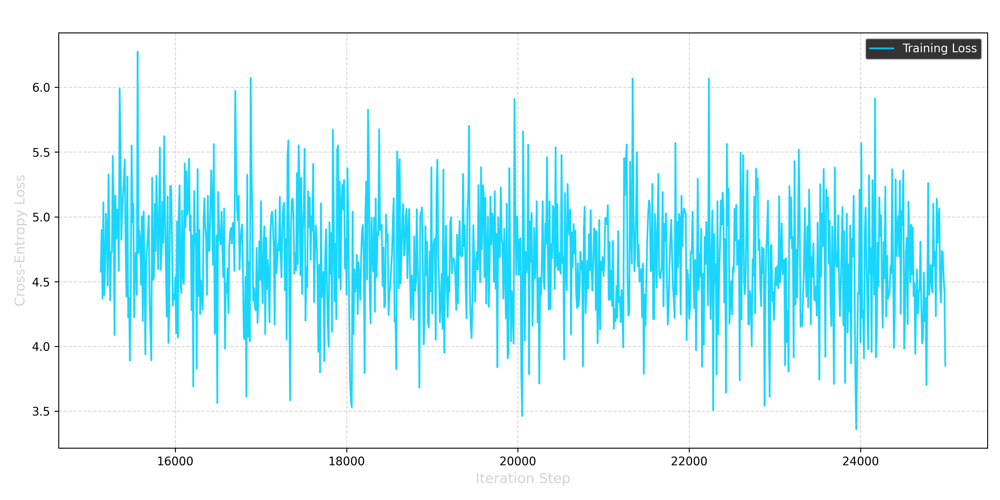

# microgpt
a Small Custom LLM trained from Scratch with a parameter of 30.5M

# MicroGPT 30.5M Parameter Custom LLM Trained from Scratch


MicroGPT is a custom-built, 30.5 million parameter Large Language Model (LLM) trained entirely from scratch. The mathematical architecture, tokenization pipeline, and training loop were written in PyTorch and optimized to train locally on consumer hardware without crashing due to VRAM limitations.

Unlike fine-tuned API wrappers, this project demonstrates a fundamental understanding of the core matrix math, attention mechanisms, and gradient descent required to build a generative AI base model.

##  Model Specifications

The architecture is a classic Decoder-only Transformer, sized specifically to maximize the compute capabilities of a 4GB VRAM GPU.

* **Total Parameters:** ~30.5 Million
* **Vocabulary Size:** 50,257 (OpenAI `tiktoken` GPT-2 Encoding)
* **Embedding Dimensions (`n_embd`):** 256
* **Transformer Layers (`n_layer`):** 6
* **Attention Heads (`n_head`):** 6
* **Context Window (`block_size`):** 128 tokens
* **Activation Function:** GELU
* **Precision:** `bfloat16` (Mixed Precision)

##  Hardware & Training Setup

Training a model from scratch requires managing intense thermal and memory loads. This model was trained on a local laptop setup, utilizing gradient accumulation to simulate large batch sizes without triggering CUDA Out-Of-Memory (OOM) errors.

* **Machine:** ASUS TUF Gaming A15 (FA506NCR)
* **CPU:** AMD Ryzen 7 7435HS
* **GPU:** NVIDIA GeForce RTX 3050 (4GB GDDR6)
* **RAM:** 16GB
* **Cooling:** Active laptop cooler angled at 40° (Maintained 40°C GPU temp at 97% utilization)

**Training Hyperparameters:**
* **Optimizer:** AdamW
* **Learning Rate:** 3e-4
* **Micro-Batch Size:** 4
* **Gradient Accumulation Steps:** 16 (Effective Batch Size: 64)
* **Iterations:** 25,000
* **Duration:** ~15 Hours

##  Dataset

The model was trained by continuously streaming the `sample-10BT` split of **HuggingFaceFW/fineweb-edu**. This dataset consists of highly filtered, high-quality educational content, textbooks, and academic journals. 

Streaming the data directly into RAM bypassed the need to download massive `.parquet` files to the local NVMe SSD, allowing for an infinite, continuous training loop.

##  Training Results & Loss Curve

The model successfully converged, dropping from a purely randomized mathematical baseline to a stabilized context-aware state.

* **Initial Loss (Iteration 0):** 11.0273
* **Final Loss (Iteration 25000):** ~3.85

*(Note: The loss stabilized around the high 3.0s and low 4.0s, indicating the model reached the physical capacity of its 30.5M parameter "brain" and squeezed as much contextual understanding as possible into its weights).*


*> The final stabilization phase of the training curve.*

##  Capabilities & Output Analysis

As a **Base Model** (not an Instruction-Tuned model), MicroGPT functions as a highly advanced text-autocomplete engine. 

**What it does well:**
* **Perfect Spelling & Tokenization:** Mastered pulling complex, multi-syllable scientific words from the embedding table.
* **Syntactic Structure:** Flawlessly replicates the formatting of educational textbooks, including bulleted lists, capitalization, and punctuation.
* **Procedural Lore Generation:** Due to the small parameter count, the model cannot memorize hard facts. Instead, it hallucinates highly confident, structurally perfect "fever dreams" (e.g., inventing historical figures or fictional chemical compounds like `Ca-V-Xin II`).

**Example Autocomplete Output:**
```text
Prompt: The mitochondria is known as the

AI Completion: two-year old man who was involved in his wife. He is known as the "The Three" (Kanguthenon). The last trunks of the 10th century had been...
